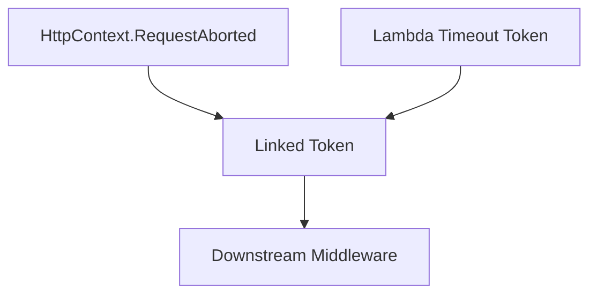

# Lambda Timeout Middleware

The `LambdaTimeoutLinkMiddleware` provides intelligent timeout handling for ASP.NET Core applications running in AWS Lambda environments. It creates a sophisticated cancellation system that responds to both client disconnections and Lambda execution timeouts.

## :rocket: Features

- **:stopwatch: Dual Cancellation**: Responds to both client disconnect and Lambda timeout scenarios
- **:shield: Graceful Shutdown**: Configurable safety buffer ensures clean application shutdown
- **:chart_with_upwards_trend: Observability**: Structured logging with detailed timeout telemetry
- **:computer: Local Development**: Pass-through mode when `ILambdaContext` is unavailable
- **:warning: Status Code Management**: Automatic HTTP status code setting (504/499)

## Basic Usage

### Simple Configuration

```csharp
using LayeredCraft.Lambda.AspNetCore.Hosting.Extensions;

public void Configure(IApplicationBuilder app, IWebHostEnvironment env)
{
    // Add early in pipeline for maximum coverage
    app.UseLambdaTimeoutLinkedCancellation();
    
    app.UseRouting();
    app.UseEndpoints(endpoints =>
    {
        endpoints.MapControllers();
    });
}
```

### Custom Safety Buffer

```csharp
public void Configure(IApplicationBuilder app, IWebHostEnvironment env)
{
    // Allow 500ms for cleanup operations
    app.UseLambdaTimeoutLinkedCancellation(TimeSpan.FromMilliseconds(500));
    
    // Other middleware...
}
```

## Configuration Options

### Safety Buffer

The safety buffer determines how much time before Lambda timeout the middleware should trigger cancellation:

| Buffer Time | Use Case | Trade-offs |
|-------------|----------|------------|
| `100ms` | Fast response, minimal cleanup | Risk of incomplete operations |
| `250ms` (default) | Balanced approach | Good for most applications |
| `500ms` | Heavy cleanup operations | Reduces effective Lambda runtime |
| `1000ms+` | Database transactions, file I/O | Significant runtime reduction |

### Safety Buffer Guidelines

```csharp
// For APIs with minimal cleanup
app.UseLambdaTimeoutLinkedCancellation(TimeSpan.FromMilliseconds(100));

// For applications with moderate cleanup needs (default)
app.UseLambdaTimeoutLinkedCancellation(); // 250ms

// For applications with heavy cleanup (database, files, etc.)
app.UseLambdaTimeoutLinkedCancellation(TimeSpan.FromMilliseconds(500));

// For applications with very heavy cleanup operations
app.UseLambdaTimeoutLinkedCancellation(TimeSpan.FromSeconds(1));
```

## Using Cancellation Tokens

### In Controllers

```csharp
[ApiController]
[Route("api/[controller]")]
public class DataController : ControllerBase
{
    private readonly IDataRepository _repository;

    public DataController(IDataRepository repository)
    {
        _repository = repository;
    }

    [HttpGet]
    public async Task<IActionResult> GetData(CancellationToken cancellationToken)
    {
        try
        {
            // This operation will be cancelled on Lambda timeout
            var data = await _repository.GetDataAsync(cancellationToken);
            return Ok(data);
        }
        catch (OperationCanceledException) when (cancellationToken.IsCancellationRequested)
        {
            // Log timeout for debugging
            return StatusCode(504, "Request timed out");
        }
    }

    [HttpPost]
    public async Task<IActionResult> CreateData([FromBody] CreateDataRequest request, 
                                               CancellationToken cancellationToken)
    {
        using var operation = _logger.BeginScope("CreateData Operation");
        
        try
        {
            // Multi-step operation with timeout awareness
            var validationResult = await ValidateRequestAsync(request, cancellationToken);
            if (!validationResult.IsValid)
                return BadRequest(validationResult.Errors);

            var data = await _repository.CreateAsync(request, cancellationToken);
            await _eventPublisher.PublishCreatedAsync(data, cancellationToken);
            
            return CreatedAtAction(nameof(GetData), new { id = data.Id }, data);
        }
        catch (OperationCanceledException) when (cancellationToken.IsCancellationRequested)
        {
            _logger.LogWarning("CreateData operation cancelled due to timeout");
            return StatusCode(504, "Operation timed out");
        }
    }
}
```

### In Services

```csharp
public class DataService : IDataService
{
    private readonly HttpClient _httpClient;
    private readonly ILogger<DataService> _logger;

    public DataService(HttpClient httpClient, ILogger<DataService> logger)
    {
        _httpClient = httpClient;
        _logger = logger;
    }

    public async Task<ExternalData> GetExternalDataAsync(string id, CancellationToken cancellationToken)
    {
        try
        {
            // External HTTP calls respect the cancellation token
            var response = await _httpClient.GetAsync($"/api/data/{id}", cancellationToken);
            response.EnsureSuccessStatusCode();
            
            var content = await response.Content.ReadAsStringAsync(cancellationToken);
            return JsonSerializer.Deserialize<ExternalData>(content);
        }
        catch (OperationCanceledException) when (cancellationToken.IsCancellationRequested)
        {
            _logger.LogWarning("External API call cancelled due to timeout for ID: {Id}", id);
            throw; // Re-throw to propagate cancellation
        }
        catch (HttpRequestException ex)
        {
            _logger.LogError(ex, "Failed to fetch external data for ID: {Id}", id);
            throw;
        }
    }

    public async Task ProcessLargeDatasetAsync(IEnumerable<DataItem> items, 
                                             CancellationToken cancellationToken)
    {
        var processedCount = 0;
        
        await foreach (var item in items.WithCancellation(cancellationToken))
        {
            await ProcessSingleItemAsync(item, cancellationToken);
            processedCount++;
            
            // Periodic cancellation checks for long-running operations
            if (processedCount % 100 == 0)
            {
                cancellationToken.ThrowIfCancellationRequested();
                _logger.LogDebug("Processed {Count} items", processedCount);
            }
        }
    }
}
```

## How It Works

### Cancellation Token Linking

The middleware creates a linked cancellation token from two sources:



1. **Original Token**: `HttpContext.RequestAborted` (client disconnect, server abort)
2. **Timeout Token**: Created from `ILambdaContext.RemainingTime - SafetyBuffer`
3. **Linked Token**: Cancels when either source cancels

### Timeline Example

```
Lambda Timeout: 30 seconds
Safety Buffer: 250ms
Effective Timeout: 29.75 seconds

0s                    29.75s    30s
|---------------------|---------|
|   Application       |Cleanup  |
|   Processing        | Period  |
```

### Local Development Behavior

When `ILambdaContext` is not available (local development):

```csharp
// Creates a "never timeout" token (24 hours)
using var timeoutCts = new CancellationTokenSource(TimeSpan.FromDays(1));

// Only client disconnect triggers cancellation
using var linkedCts = CancellationTokenSource.CreateLinkedTokenSource(
    original, // HttpContext.RequestAborted
    timeoutCts.Token // Never fires locally
);
```

## HTTP Status Codes

The middleware automatically sets appropriate status codes:

| Scenario | Status Code | Description |
|----------|-------------|-------------|
| Lambda timeout | `504 Gateway Timeout` | Standard timeout response |
| Client disconnect | `499 Client Closed Request` | Non-standard but widely recognized |

### Status Code Handling

```csharp
// In the middleware's exception handler
var byTimeout = timeoutCts.IsCancellationRequested;

context.Response.StatusCode = byTimeout
    ? StatusCodes.Status504GatewayTimeout  // 504
    : ClientClosedRequest;                 // 499
```

## Logging and Observability

### Structured Logging

The middleware uses `LayeredCraft.StructuredLogging` for rich telemetry:

```csharp
_logger.Warning(
    "Request cancelled ({Reason}). Path: {Path}, RemainingTimeMs: {RemainingMs}",
    byTimeout ? "Lambda timeout" : "Client disconnect",
    context.Request.Path,
    lambdaContext?.RemainingTime.TotalMilliseconds);
```

### Sample Log Output

```json
{
  "timestamp": "2024-01-15T14:30:25.123Z",
  "level": "Warning",
  "message": "Request cancelled (Lambda timeout). Path: /api/data, RemainingTimeMs: 245.7",
  "properties": {
    "Reason": "Lambda timeout",
    "Path": "/api/data",
    "RemainingTimeMs": 245.7
  }
}
```

## Best Practices

### Placement in Pipeline

Place the middleware **early** in the pipeline to ensure all downstream components receive the timeout-aware token:

```csharp
public void Configure(IApplicationBuilder app, IWebHostEnvironment env)
{
    // ✅ Good: Early placement
    app.UseLambdaTimeoutLinkedCancellation();
    
    app.UseAuthentication();
    app.UseAuthorization();
    app.UseRouting();
    app.UseEndpoints(endpoints => endpoints.MapControllers());
}
```

### Service Registration

Ensure your services accept and use cancellation tokens:

```csharp
public void ConfigureServices(IServiceCollection services)
{
    // Configure HttpClient with reasonable timeouts
    services.AddHttpClient<IExternalService, ExternalService>(client =>
    {
        client.Timeout = TimeSpan.FromSeconds(25); // Less than Lambda timeout
    });
    
    services.AddScoped<IDataRepository, DataRepository>();
}
```

### Testing Timeout Scenarios

```csharp
[Test]
public async Task Should_Handle_Cancellation_Gracefully()
{
    // Arrange
    using var cts = new CancellationTokenSource(TimeSpan.FromMilliseconds(100));
    var service = new DataService(_httpClient, _logger);
    
    // Act & Assert
    await Assert.ThrowsAsync<OperationCanceledException>(
        () => service.GetExternalDataAsync("test-id", cts.Token));
}
```

## Troubleshooting

### Common Issues

#### 1. Timeout Too Short

**Symptom**: Frequent 504 errors in logs
**Solution**: Increase safety buffer or optimize application performance

```csharp
// Increase buffer if cleanup operations are heavy
app.UseLambdaTimeoutLinkedCancellation(TimeSpan.FromMilliseconds(500));
```

#### 2. Services Not Respecting Cancellation

**Symptom**: Application continues processing after timeout
**Solution**: Ensure all async operations accept `CancellationToken`

```csharp
// ❌ Bad: No cancellation token
await _httpClient.GetAsync(url);

// ✅ Good: Respects cancellation
await _httpClient.GetAsync(url, cancellationToken);
```

#### 3. Middleware Placed Too Late

**Symptom**: Some requests don't get timeout protection
**Solution**: Move middleware earlier in pipeline

```csharp
// ❌ Bad: After other middleware
app.UseAuthentication();
app.UseLambdaTimeoutLinkedCancellation(); // Too late!

// ✅ Good: Early in pipeline
app.UseLambdaTimeoutLinkedCancellation();
app.UseAuthentication();
```

### Debugging Tips

1. **Check Lambda logs** for timeout warnings
2. **Monitor CloudWatch metrics** for Lambda duration patterns
3. **Use structured logging** to correlate timeout events
4. **Test locally** with short-lived cancellation tokens

## Advanced Scenarios

### Custom Timeout Logic

For advanced scenarios where you need custom timeout behavior:

```csharp
public class CustomTimeoutMiddleware
{
    private readonly RequestDelegate _next;
    private readonly ILambdaContext _lambdaContext;

    public async Task InvokeAsync(HttpContext context)
    {
        // Access the timeout-aware token set by LambdaTimeoutLinkMiddleware
        var timeoutToken = context.RequestAborted;
        
        // Your custom timeout logic here
        using var customCts = CancellationTokenSource.CreateLinkedTokenSource(timeoutToken);
        
        // Add custom timeout conditions
        if (ShouldUseCustomTimeout(context))
        {
            customCts.CancelAfter(TimeSpan.FromSeconds(5));
        }
        
        // Replace token for downstream middleware
        context.RequestAborted = customCts.Token;
        
        try
        {
            await _next(context);
        }
        finally
        {
            // Restore original token
            context.RequestAborted = timeoutToken;
        }
    }
}
```

## Performance Considerations

- **Minimal Overhead**: Middleware adds < 1ms per request
- **Memory Efficient**: Uses linked cancellation tokens, not polling
- **GC Friendly**: Properly disposes all cancellation token sources
- **Thread Safe**: All operations are thread-safe

## Migration Guide

### From Manual Timeout Handling

If you previously handled Lambda timeouts manually:

```csharp
// ❌ Old manual approach
public class OldController : ControllerBase
{
    [HttpGet]
    public async Task<IActionResult> GetData()
    {
        var lambdaContext = HttpContext.Items["LambdaContext"] as ILambdaContext;
        using var cts = new CancellationTokenSource(lambdaContext.RemainingTime - TimeSpan.FromMilliseconds(250));
        
        // Manual timeout management...
    }
}

// ✅ New approach with middleware
public class NewController : ControllerBase
{
    [HttpGet]
    public async Task<IActionResult> GetData(CancellationToken cancellationToken)
    {
        // Timeout is automatically handled by middleware
        var data = await _service.GetDataAsync(cancellationToken);
        return Ok(data);
    }
}
```